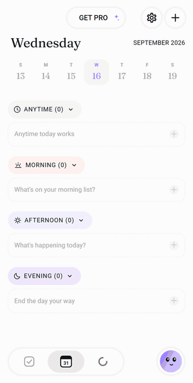
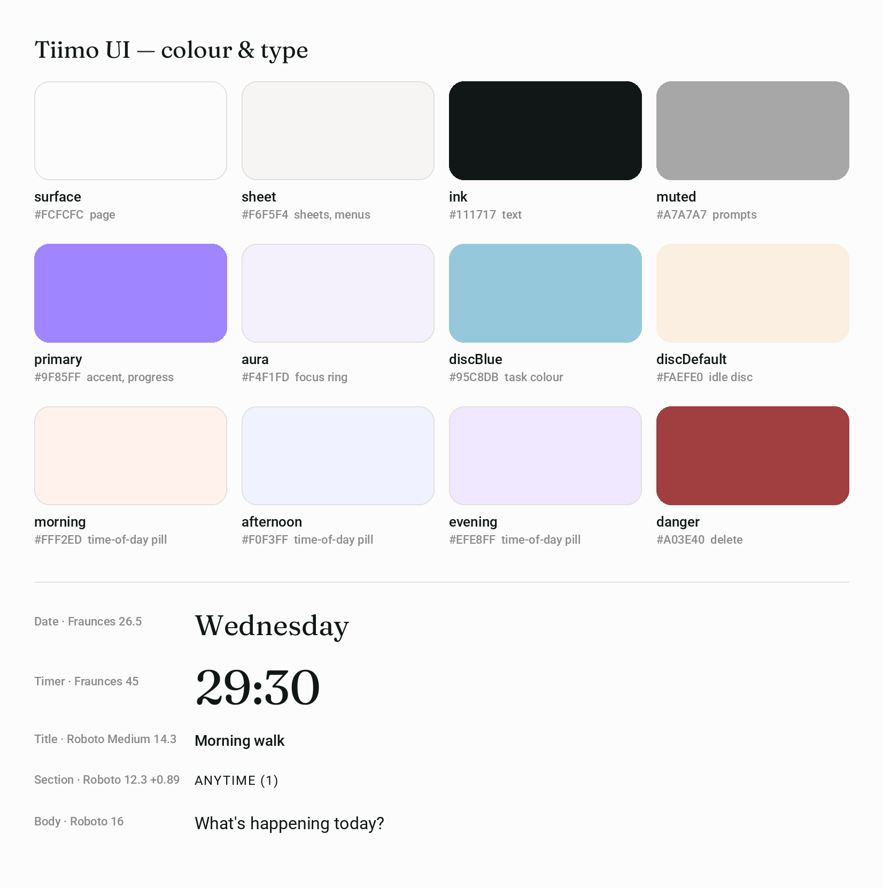

<p align="center">
  <a href="https://tiimo-ui.edgeone.cool"></a>
</p>

<h1 align="center">Tiimo UI</h1>

<p align="center">
  <a href="https://tiimo-ui.edgeone.cool"></a>
</p>

<p align="center">
  A high-fidelity, interactive recreation of Tiimo's visual planner — real components, real state, running in your browser.<br>
  <a href="DESIGN.md">DESIGN.md</a> · <a href="#design-notes">Design notes</a> · <a href="#explore-the-prototype">Explore</a> · <a href="#run-locally">Run locally</a> · <a href="#scope-and-limitations">Scope</a>
</p>

---

Created to help people get to know Tiimo through a hands-on exploration of its interface, and to appreciate the details that make a visual day plan feel calm and approachable. For the full experience of planning and focusing with Tiimo, explore [Tiimo](https://www.tiimoapp.com).

Everything runs locally in your browser; it does not connect to a Tiimo account.

## Design notes

What makes Tiimo's interface work, and what this recreation had to get right.

**Time of day is a colour, not a clock.** The Today plan is split into Anytime, Morning, Afternoon and Evening, each marked by a pale pill of its own — peach, periwinkle, lavender, with Anytime left neutral. You place a task in a part of the day instead of at a minute, which lowers the precision a plan asks of you.

**Calm by subtraction.** The page is an off-white `#FCFCFC` with a softened near-black `#111717`. There are almost no hard lines: white controls float on a soft shadow, and an empty section is a faint dashed card with a friendly prompt ("What's on your morning list?") rather than an empty state.

**Two voices of type.** A soft serif carries the moments — the day's name, the task in focus, the countdown, the day numbers — while Roboto carries everything you act on. Section labels are small and tracked out (12.3 dp, +0.89) so they read as quiet signposts rather than headings.

**Time you can see.** In focus mode a purple arc grows clockwise from twelve o'clock, one full turn per task, with a small arrow riding its head. The digits say how long is left; the arc lets you feel it at a glance.

**One accent, used sparingly.** Lavender `#9F85FF` is reserved for what is active: the selected day, the save button, marker chips and the progress arc. Nothing else competes for it.

**Gentle, not alarming.** Deleting a task blurs the page behind a soft dialog instead of blacking it out, and the destructive button is a muted plum rather than a warning red.

## Design system at a glance

<p align="center"></p>

The full token set — colours, type scale, spacing, radii, elevation and component notes — is in [DESIGN.md](DESIGN.md); the values live in [`src/tokens.ts`](src/tokens.ts).

## Explore the prototype

| Area | Things to try |
|---|---|
| Today | Add a task with the + button, collapse and expand the Anytime, Morning, Afternoon and Evening sections, and tick a task off to move it to Done. |
| Task actions | Tap a task to open its action menu: start it, edit it, or delete it with a confirmation. |
| Update task | Rename a task, change its duration, time of day or repeat option, then save or close without saving. |
| Focus | Start a task, pause and resume the countdown, and watch the purple arc travel round the ring. |

### A first walkthrough

1. On **Today**, tap **+** and type a task name, then press Enter.
2. Tap the task, choose **Edit task**, set the duration to 15 minutes and save.
3. Tap the task again and choose **Start task**; pause and resume the timer.
4. Go back to **Today**, tick the task, and open **Done** to see it there — tap its check again to undo.

Tasks live only in this page; reloading starts a fresh day.

## Run locally

Use Node.js 22.13 or newer in the Node.js 22 release line, with npm.

```bash
npm ci --ignore-scripts
npm run web
```

Open the local URL printed by Expo. Dependency installation requires an internet connection. No Tiimo account or API key is required.

### Build for the web

```bash
npm run typecheck
npm run build:web
```

The static output is written to `dist/`. Serve that directory over HTTP or HTTPS; opening `index.html` directly as a local file is not supported.

## Scope and limitations

- **First batch of screens.** This edition covers the Today plan, the task action menu, the Update-task sheet, the focus timer and the delete confirmation. The To-do list, Repeat picker and quick-create sheet are included but belong to the next batch and have not yet been refined to the same standard.
- **Task emoji.** Tiimo picks a task's emoji automatically from its name. This prototype does not reproduce that and always shows 📝.
- **Typeface.** Tiimo uses Recoleta, a commercial typeface. This prototype uses the open Fraunces, sized to the same widths; stroke weight differs slightly.
- **Artwork.** The profile character is replaced by a plain gradient, and a few small vector icons are close approximations.
- **Not yet built.** Timer completion at 00:00, sub-task editing, notes, the date picker and Move to list are shown but not functional.
- **Mobile layout on the web.** The interface is designed for a phone-width column; on wider screens it stays a centred column.
- **Validation scope.** The first-batch screens and responsive layouts have been checked in Chromium. This does not establish complete feature coverage, full visual equivalence, Safari/Firefox compatibility, or native Android/iOS acceptance.

## Commission a prototype

Have an app whose screens you want to put in front of your team, a client or investors? I recreate chosen app interfaces and flows as high-fidelity, interactive prototypes and hand over the source code. [Open an issue](https://github.com/migrant620/tiimo-ui/issues/new?title=Prototype%20enquiry) with the app, the flow you need and your timeline.

## License

The prototype's original code and materials are **source-available for noncommercial self-directed study and research only**, under the [M620 Study and Research License](LICENSE). Commercial products, business use, client deliverables, and hosted services are not permitted without a separate written license. Free access does not itself permit commercial use.

This is not an open-source license. Third-party components retain their own licenses.

## Attribution

This is an independent prototype by M620, not an official Tiimo product and not affiliated with or endorsed by Tiimo. Third-party names identify the interface being demonstrated.

Bundled fonts retain their own licenses: Roboto and Fraunces under the SIL Open Font License 1.1, and the icon fonts under the licenses listed in `assets/fonts/`. See the [third-party notices](public/third-party-notices.txt); the Web build also serves this file at `/third-party-notices.txt`.
